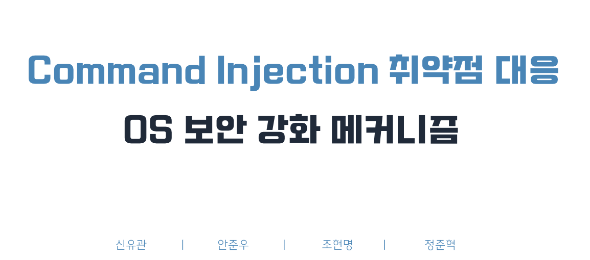

# OS_Project
2025-1학기 OS 프로젝트

# Command Injection 취약점 대응 OS 보안 강화 메커니즘

## 💻 개요 및 목적

- 정보화 사회 발전에 따른 시스템 및 네트워크 보안의 중요성 증대 (2025년 SKT 유심 정보 유출 대란)
- Command Injection을 통한 관리자 권한 탈취, 데이터 유출이 가능
- 목적 : OS 수준 보안 강화 메커니즘을 설계 및 구현하여, 해당 공격 유형을 방어하도록 함

## 🧍🏼‍♂️ 역할 분담

- 신유관 : 취약점 재현 코드(vulnerable.c) 및 기본 방어 코드(secure.c)설계
- 안준우 : LD_PRELOAD를 사용한 보안 감시 모듈 개발
- 조현명 : 실험 실행 및 분석
- 정준혁 : 문서화 및 발표 자료 제작

## 📆 개발 기간 및 진행상황

- 25.05.14 ~ 28.
- Command Injection 내용 학습(25.05.14.)
- 취약 코드 및 방어 코드 1차 구현 완료(25.05.20)
- PPT 1차 작업 완료(25.05.21)

## 🛠️ 개발 환경

- Linux(UNIX) : 컴파일 및 실행
- VSCode : 코드 작성
- Language : C

## 차후 과제

- general한 상황도 포함시킬 것인지?
- PPT 수정 및 스크립트 작성

